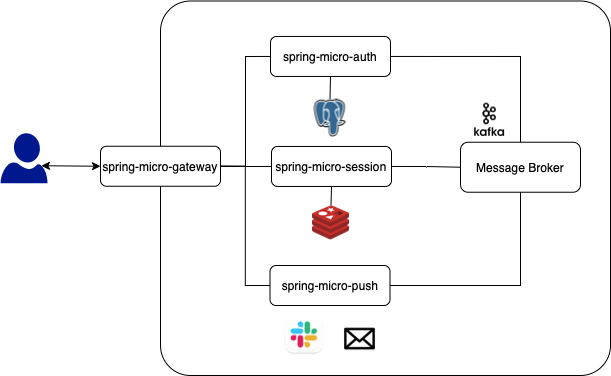

# spring-micro-auth
In this project, I will create a simple Auth service which can create an account and get JwtToken after logged in. 
This is the first project to make a microservice architecture using Spring boot framework.
This project is getting evolved as times go on. 

## Microservice Architecture

## Deployment
This project is deployed by Jenkins and ArgoCD. 

## Authors
Allen Kim - Initial work - [coolexplorer](https://github.com/coolexplorer)

## License
This project is licensed under the MIT License - see the LICENSE.md file for details
